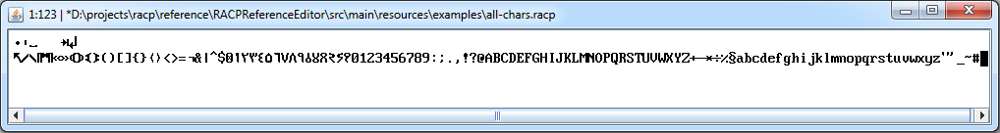

# RACP Reference Editor

A reference editor for the RACP character set.

This editor showcases the use of the character set with basic features. It is not meant to be a fully fledged editor. It has a limited feature set, is not user friendly, and is definitely not efficient.
Instead it offers the ability to view and edit small RACP files. Most importantly it allows for viewing and typing of all the RACP characters, even those not found in or on any modern editor or keyboard.

## Building the editor

Building the editor requires Java 8+ JDK.

In a terminal or command prompt use the following command to build the editor (from this directory):

``> gradlew clean build``

An executable Jar file can then be found in ``\build\libs\``. Running the editor requires Java 8+ JRE.

## Example

The image below is an example of the editor displaying all the characters in encoded order.

